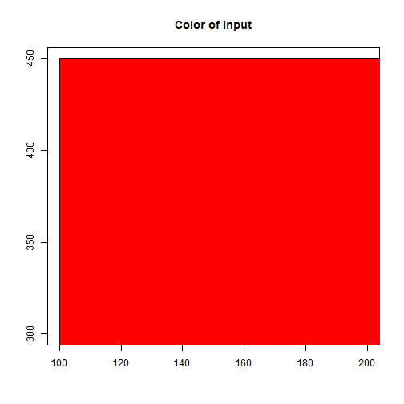

## The Concept

The idea of this Shiny app is very simple.
You put in values of Red, Green and Blue to generate a color.
This can be used to teach Color Theory and the various ways
we represent colors in this day and age.


---
## Exposure to Hexadecimal

Another promise of this app is the exposure to Hexadecimal. There are a number of people who know hexadicmal representation fairly well, but for those that do not, you can use this app to get a feel of how the numbers change as colors change.

For example, this is how pure Red looks like, Red = 255, Green = 0, Blue = 0.


```r
redHex<- createHex(red=255,green=0,blue=0) #custom function
print(redHex)
```

```
## [1] "#FF0000"
```

```r
plot(c(100, 200), c(300, 450), type= "n", xlab = "", ylab = "", main="Color of Input")
rect(100, 200, 300, 450, col = redHex, border = "black")
```

 


---

## Inverted color

How would it's inverted color look like? It would just be flipping the numbers. In the first case, Red = 255, Green = 0, Blue = 0. In this inverted case, Red = 0, Green = 255, Blue = 255.


```r
invertRedHex <- invertHex(createHex(red=255,green=0,blue=0))
print(invertRedHex)
```

```
## [1] "#00FFFF"
```

```r
plot(c(100, 200), c(300, 450), type= "n", xlab = "", ylab = "", main="Color of Input")
rect(100, 200, 300, 450, col = invertRedHex, border = "black")
```

 

---

## Conclusion
Playing with this app will hopefully give a better understanding of how the RGB changes colors as the values change. While not having immediate effect, this insight of how color works in the RGB scheme could help inspire some thinking in other areas. 

Steve Job's took a calligraphy class in college, and that forever changed how computer typography looked.

Perhaps an artist or someone who isn't very intimate with computer representation could benefit, albeit unconciously.
